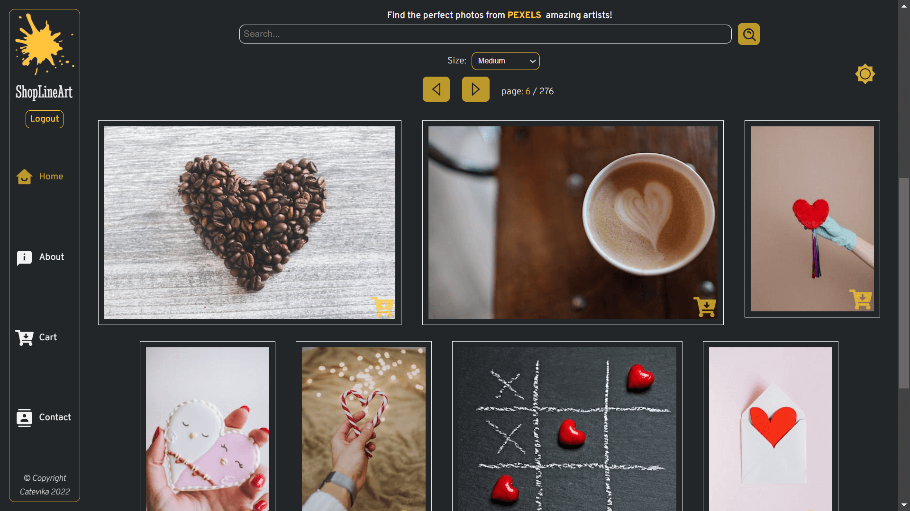

# ShopLineArt SERVER



## Table of Content <!-- omit in toc -->

- [ShopLineArt SERVER](#shoplineart-server)
  - [General Information](#general-information)
  - [NPM packages](#npm-packages)
  - [ShopLineArt CLIENT](#shoplineart-client)
  - [To clone the ShopLineArt app SERVER and CLIENT repositories](#to-clone-the-shoplineart-app-server-and-client-repositories)

## General Information

- Node server: **Express**
- Database: **Mongoose**
- Authentication: **jsonwebtoken**
- Password encryption: **bcrypt**

## NPM packages

- Secure variables: **dotenv**
- CORS management: **cors**
- Secure HTTP headers: **helmet**
- HTTP request logger middleware: **morgan**
- Automatic restart on file change: **nodemon**
- Run server & client with one script only: **concurrently**

## ShopLineArt CLIENT

See [https://github.com/Catevika/catevika_shoplineart-client](https://github.com/Catevika/catevika_shoplineart-client)

---

## To clone the ShopLineArt app SERVER and CLIENT repositories

```cli
mkdir shoplineart-clone
cd shoplineart-clone

mkdir server
cd server
git clone https://github.com/Catevika/catevika_shoplineart-server.git
npm install
touch .env
```

---

Create a project in MongoDB and set MONGO_URI

Set an EXPRESS_PORT, mine is at '8800'

Set JWT_KEY with your random secret phrase used during the token generation

then

```cli
cd ..
mkdir client
cd client
git clone https://github.com/Catevika/catevika_shoplineart-client.git
npm install

touch .env
```

---

Create a **PEXELS** developer account to set the **VITE_PEXELS_API_KEY**

To set **VITE_BASE_URL**:

- development: your Vite localhost
- production: your client site url

---

Create an **EMAILJS** developer account

Create your **template** with: fullname, email, subject, message

Set:

- **VITE_EMAILJS_PUBLIC_KEY**
- **VITE_EMAILJS_SERVICE_ID**
- **VITE_EMAILJS_TEMPLATE_ID**

then

```cli
cd ../server
npm run dev
```

See the respective **package.json** files to launch the client and the server separately
